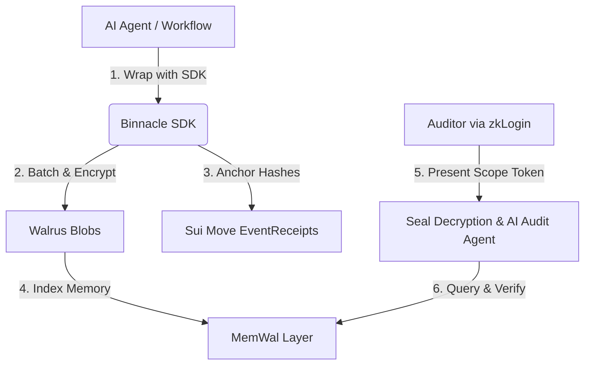

# ⚓ Binnacle

> **Track**: Walrus (Sui Overflow 2026)
> 
> *A verifiable, agent-queryable compliance and audit memory vault for decentralised protocols, DAOs, and crypto funds — powered by **Walrus** + **MemWal** + **Sui Move** + **Seal**.*

---

## 🚨 The Pain Point

As regulators globally (such as the **EU AI Act**, **NIST AI RMF**, **MAS FEAT**, and **HKMA**) transition from *"publish a compliance policy"* to *"produce the verifiable logs"*, enterprises face a structural vulnerability:

1. **Mutable SaaS Observability**: Existing trace and log managers (e.g. LangSmith, Helicone) are centralized and mutable. If a regulator subpoenas audit logs, there is no cryptographic guarantee that a developer hasn't pruned a record or that the vendor hasn't altered history.
2. **Privacy vs Auditability**: Compliance teams must log agent behaviour (prompts, retrieved contexts, and decisions) without leaking protected information (PII/PHI) to third-party databases.
3. **Audit Theatre**: Current audits rely on manual exports of unsigned JSONs and screen-shares, which fail basic institutional chain-of-custody standards.

---

## ⚓ The Solution: Binnacle

**Binnacle** (named after the marine casing that protects a ship’s compass and logbook) provides an immutable, cryptographically verifiable record of AI agent activity and financial workflows. 



### 🔒 Key Capabilities
* **Immutable Logs on Walrus** 📦: Every prompt, tool execution, model version, and human override is encrypted and written as a Walrus blob, enforcing cost-effective, long-term WORM (Write Once, Read Many) retention.
* **Hash-Chained On-Chain Receipts** ⛓️: Sui Move smart contracts mint a sequence of `EventReceipt` objects. Each receipt points to the parent receipt's hash, forming an append-only, tamper-evident cryptographic log anchored on the Sui blockchain.
* **Selective Disclosure via Seal** 🔑: Scoped decryption keys are threshold-encrypted using Seal. Auditors can only decrypt logs that fall within a time-bounded, customer-signed `EngagementObject` minted on-chain.
* **Natural-Language Audit Agent (MemWal)** 🤖: Instead of digging through raw databases, auditors log in via **zkLogin** and query the audit agent (e.g. *"Show all Q3 decisions where the credit agent overrode the bureau score"*). The agent answers in natural language, citing verifiable Walrus blob IDs.

---

## 🛠️ Technical Architecture

* **Storage Layer**: **Walrus** handles encrypted event blobs. Custom retention periods are enforced via Sui object epoch policies.
* **Trust Anchor**: **Sui Move** contracts manage namespaces, register audit policies, and anchor hash-chained transaction receipts.
* **Encryption Layer**: **Seal** threshold cryptography splits decryption keys between the customer's KMS, Binnacle's key node, and a trusted third party (e.g. a law firm).
* **Search & Memory**: **MemWal** indexes ingested agent footprints to enable sub-second vector search and context retrieval for the audit agent.

---

## 🚀 Hackathon Demo Flow

1. **Instrumentation**: See the 4-line SDK integration logging a simulated credit-scoring agent's decisions over 30 days.
2. **Audit Interface**: An auditor onboarded via **zkLogin** submits a scoped audit token.
3. **Conversational Query**: The auditor asks for policy overrides; the agent retrieves matching records from **MemWal**.
4. **Verifiable Proof**: The UI pulls the corresponding raw encrypted blob from **Walrus**, decrypts it via **Seal**, and verifies its integrity against the hash anchored on **Sui Explorer**.
5. **Tamper Test**: Modifying the local logs or attempting access without an active `EngagementObject` triggers an instant cryptographic alarm.

---

## 📦 Developer Quickstart

### Installation
```bash
npm install @binnacle/sdk
```

### Initialisation
```typescript
import { Binnacle } from '@binnacle/sdk';

const binnacle = new Binnacle({
  namespace: 'our-credit-agent',
  signer: suiSigner,
  encryption: 'seal-threshold'
});
```

### Logging Events
```typescript
await binnacle.log({
  type: 'agent_decision',
  runId: 'run_99f093',
  payload: {
    input: applicantData,
    decision: 'DENIED',
    override: true,
    reason: 'High debt-to-income ratio override by senior underwriter'
  }
});
```
