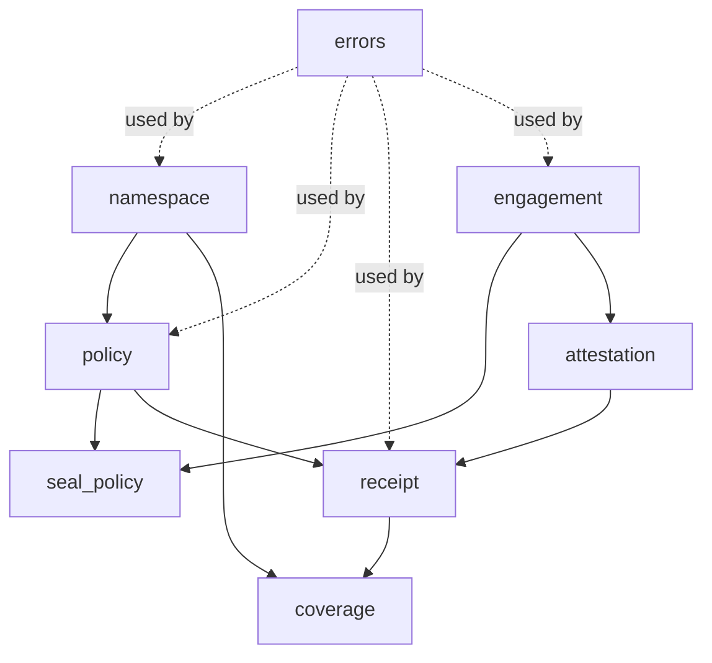

# ComplianceVault — System Architecture Specification

> Version: v0.2 (hackathon draft, derived from BUSINESS_SPEC v1.0)
> Date: 2026-05-28 (architecture review applied 2026-05-30)
> Target: Sui testnet (Protocol 124, v1.72.2) → mainnet
> Stack: Sui Move + Walrus + Seal + MemWal + TypeScript SDK + Next.js auditor UI
> **Assumption flags** (`[A:n]`) mark decisions made without user confirmation — revisit before implementation.
>
> **v0.2 changelog (sui-architect review):** Made object ownership model explicit (B1–B4); defined `WriterCap` (C1); added on-chain hash-chain enforcement (C2); per-fn namespace-binding asserts (C3); switched Seal gating to `seal_approve` abort pattern (C4); froze `BatchReceipt` + moved blob_ids off-chain (E1–E2); added `version` field to all persisted objects (U1). Full review log in §19.

---

## 1. Executive Summary

ComplianceVault is a **verifiable audit-memory backbone for AI agents**. Every agent event is:

1. Encrypted client-side (Seal threshold) → uploaded as a Walrus blob.
2. Hashed and chained into a per-`runId` Merkle accumulator.
3. Anchored to Sui via a `BatchReceipt` object (one tx per N events, not per event).
4. Indexed into a MemWal namespace for natural-language audit queries.

Auditors gain time-bounded, scope-bounded decryption via on-chain `EngagementObject` + Seal threshold shares — **no vendor mediation, no master key**.

---

## 2. Architecture Overview

```
┌─────────────────────────────────────────────────────────────────┐
│                        Customer Side                            │
│  ┌──────────┐    ┌────────────────────────────────────────┐    │
│  │  Agent   │───▶│  @compliancevault/sdk (TypeScript)     │    │
│  │ (LLM)    │    │  - sign · seal-encrypt · batch · upload│    │
│  └──────────┘    └──────┬─────────────────────┬───────────┘    │
│                         │                     │                 │
│                         ▼                     ▼                 │
│                   ┌──────────┐         ┌─────────────┐         │
│                   │  Walrus  │         │ Sui Move    │         │
│                   │  (blob)  │         │ - Namespace │         │
│                   └────┬─────┘         │ - Policy    │         │
│                        │               │ - BatchRcpt │         │
│                        ▼               │ - Engagement│         │
│                   ┌──────────┐         │ - Attest    │         │
│                   │  MemWal  │◀────────┤ - Coverage  │         │
│                   │ (index)  │         └─────┬───────┘         │
│                   └──────────┘               │                 │
│                                              │                 │
└──────────────────────────────────────────────┼─────────────────┘
                                               │
┌──────────────────────────────────────────────┼─────────────────┐
│                       Auditor Side           ▼                 │
│  ┌──────────────┐    ┌──────────────────────────────────┐     │
│  │ Next.js UI   │───▶│ zkLogin → fetch EngagementObject │     │
│  │ (auditor)    │    │ → request Seal shares            │     │
│  └──────┬───────┘    │ → decrypt scoped subset only     │     │
│         │            └──────────────────────────────────┘     │
│         ▼                                                      │
│  ┌──────────────────────────────────────────┐                 │
│  │ Audit-Agent (MemWal RAG + LLM)           │                 │
│  │ → NL query → cited blob_ids + Sui digest │                 │
│  └──────────────────────────────────────────┘                 │
└────────────────────────────────────────────────────────────────┘
```

### 2.1 Trust Boundaries

| Boundary | Who can mutate? | Verified by |
|---|---|---|
| Walrus blob bytes | No one (content-addressed) | Sui `BatchReceipt.merkle_root` |
| Sui object state | Only via Move entry fns | On-chain Move bytecode |
| Seal key shares | k-of-n threshold (k=2, n=3 `[A:1]`) | Move-enforced `EngagementObject` check |
| MemWal index | Customer + ComplianceVault | Cross-check against on-chain receipts |
| Audit-agent answer | Not trusted — citations are | Auditor re-verifies cited blob hashes |

---

## 3. Module Architecture (Sui Move)

Package: `compliance_vault` (Move 2024 edition)

```
sources/
├── namespace.move        # AgentNamespace + AdminCap + WriterCap
├── policy.move           # PolicyObject (retention, encryption, allowlist)
├── receipt.move          # BatchReceipt (frozen) + per-event Merkle proof verify
├── engagement.move       # EngagementObject (auditor scope/expiry)
├── attestation.move      # AuditorAttestation (signed report anchor)
├── coverage.move         # CoverageHeartbeat (sequence gap detection)
├── seal_policy.move      # Seal seal_approve gating (Move-side, abort-on-deny)
├── errors.move           # Centralized error codes
└── events.move           # Event<T> emissions for off-chain indexers
```

### 3.1 Module Dependency



### 3.2 Why these splits

- `receipt` is the **hot path** (every batch hits it) — kept minimal, no policy logic.
- `engagement` + `seal_policy` are isolated so Seal SDK churn doesn't ripple.
- `coverage` is separate so the gap-detection invariant can be tested in isolation.

---

## 4. Data Structures

> **Object ownership legend (v0.2):** every persisted struct now states its on-chain disposition.
> `[shared]` = `transfer::share_object` (mutable by any tx that names it; access-gated by cap/field asserts).
> `[owned]` = transferred to a single address.
> `[frozen]` = `transfer::freeze_object` (immutable, publicly readable, never enters consensus).

### 4.1 Core Objects

```move
// namespace.move
// [shared] — writer (WriterCap holder) and admin (AdminCap holder) are different
// addresses, so the namespace MUST be shared for both to pass it as &mut. (B1)
public struct AgentNamespace has key {
    id: UID,
    version: u16,              // U1 — migration gating from day 1
    owner: address,            // customer org admin (informational; auth is via caps)
    agent_id: String,          // human label, e.g. "lending-agent-prod"
    policy: PolicyObject,      // B4 — embedded, not an ID; hot path reads it directly
    seq_next: u64,             // monotonic sequence per namespace
    batch_index: u64,          // C2 — monotonic batch counter
    last_batch_hash: vector<u8>, // C2 — on-chain head of the batch hash chain
    last_anchor_epoch: u64,
    sealed: bool,              // policy frozen once true
}

// [owned] — transferred to the customer compliance officer at creation.
public struct AdminCap has key, store {
    id: UID,
    namespace_id: ID,
}

// [owned] — transferred to the agent runtime. C1 — narrowest write capability.
public struct WriterCap has key, store {
    id: UID,
    namespace_id: ID,
}

// policy.move
// B4 — no longer a standalone key object; embedded by value inside AgentNamespace.
// `store` retained so it can live as a field; `id`/UID removed.
public struct PolicyObject has store, drop {
    retention_epochs: u64,         // Walrus epochs to keep blobs alive
    encryption_mode: u8,           // 0=none, 1=envelope, 2=seal_threshold
    seal_threshold: Option<SealConfig>,
    auditor_allowlist: vector<address>,   // [A:2] address-based for MVP
    immutable: bool,               // if true, no further mutation allowed
}

public struct SealConfig has store, copy, drop {
    k: u8,                          // threshold (SDK `threshold:`) — k=2 confirmed [A:1]
    n: u8,                          // total shares — n=3 confirmed [A:1]
    key_server_ids: vector<ID>,    // Seal key server *object IDs* (not URLs/registry); maps to SDK serverConfigs[].objectId, weight 1 each [A:1]
}

// receipt.move
// [frozen] — E1. Created once, never mutated, publicly readable for verification.
// `key` only (no store) so it cannot be wrapped after freezing.
public struct BatchReceipt has key {
    id: UID,
    version: u16,                   // U1
    namespace_id: ID,
    run_id: vector<u8>,             // bytes32 — agent run identifier
    batch_index: u64,               // per-namespace monotonic
    seq_start: u64,                 // first event seq in batch
    seq_end: u64,                   // last event seq in batch (inclusive)
    merkle_root: vector<u8>,        // 32B SHA-256 root over event hashes (commits blob_ids too)
    blob_ids_digest: vector<u8>,    // E2 — 32B hash of the ordered blob_id list; full list in BatchAnchored event
    parent_batch_hash: vector<u8>,  // C2 — equals ns.last_batch_hash at anchor time
    batch_hash: vector<u8>,         // C2 — H(parent_batch_hash || merkle_root || seq_start || seq_end); new chain head
    created_at_ms: u64,
    created_epoch: u64,
}

// engagement.move
// [shared] — admin must revoke (&mut) AND Seal key server must read (&); auditor is
// neither the owner-of-record nor the only reader, so it cannot be owned. (B3)
// Auth is by `auditor_addr` field compare, not by object ownership.
public struct EngagementObject has key {
    id: UID,
    version: u16,                   // U1
    namespace_id: ID,
    auditor_addr: address,          // zkLogin-derived address
    auditor_pubkey: vector<u8>,
    scope_start_ms: u64,
    scope_end_ms: u64,
    event_type_filter: vector<String>,   // empty = all types
    expires_at_ms: u64,
    revoked: bool,
}

// attestation.move
// [frozen] — signed report anchor, immutable once filed.
public struct AuditorAttestation has key {
    id: UID,
    version: u16,                   // U1
    engagement_id: ID,
    report_blob_id: vector<u8>,     // signed PDF/JSON on Walrus
    report_hash: vector<u8>,
    cited_batch_ids: vector<ID>,
    signed_at_ms: u64,
}

// coverage.move
// [shared] — off-chain watcher posts gap-detection txs against it.
public struct CoverageHeartbeat has key {
    id: UID,
    version: u16,                   // U1
    namespace_id: ID,
    seq_observed: u64,              // SDK reports each batch
    expected_next: u64,
    last_heartbeat_ms: u64,
}
```

### 4.2 Off-chain (Walrus) blob schema

Per-event blob payload (CBOR, encrypted if policy demands):

```
{
  v: 1,
  ns: "<namespace_id>",
  run_id: "<bytes32>",
  seq: <u64>,                 // monotonic, matches BatchReceipt range
  ts_ms: <u64>,
  type: "tool_call" | "prompt" | "completion" | "override" | "decision" | ...,
  agent: { model: "...", version: "...", prompt_hash: "..." },
  input_hash: "<sha256>",     // raw input stored separately if large
  output_hash: "<sha256>",
  payload: { ... },           // domain-specific
  prev_event_hash: "<sha256>" // intra-run chain (independent of batch)
}
```

### 4.3 MemWal index schema

```
namespace: cv:<namespace_id>
record_key: <run_id>:<seq>
fields:
  - embedding (text representation of event)
  - metadata: { ts_ms, type, batch_id, blob_id, run_id, seq }
  - sealed: bool  // true → embedding generated from public metadata only
```

When `sealed=true`, embeddings are derived only from non-PII metadata (timestamps, types, model versions). Decrypted content is only embedded into a transient per-engagement index during the engagement window.

---

## 5. Core Functions (Move API)

> **v0.2 conventions:** object constructors do NOT return `key`-only objects from `entry`
> functions (B2). They `share_object`/`freeze_object` internally and `transfer` caps to the
> sender. Every cap-gated fn asserts `cap.namespace_id == object::id(ns)` (or matches
> `eng.namespace_id`) before mutating (C3). Internal cross-module mutators are `public(package)`.

### 5.1 Lifecycle

```move
// namespace.move
// B2 — shares the namespace internally; returns the two caps for the PTB to route.
// (entry fns can return objects with `store`; AdminCap/WriterCap both have `store`.)
public fun create_namespace(
    agent_id: String,
    policy: PolicyObject,           // B4 — passed by value, embedded into the namespace
    ctx: &mut TxContext,
): (AdminCap, WriterCap) {
    // ... build AgentNamespace { version: 1, seq_next: 0, batch_index: 0,
    //                            last_batch_hash: b"", sealed: false, policy, ... }
    // transfer::share_object(ns);     // B1
    // return (AdminCap, WriterCap) — PTB transfers them to chosen addresses
}

public entry fun seal_namespace(ns: &mut AgentNamespace, cap: &AdminCap) {
    // assert!(cap.namespace_id == object::id(ns), E_UNAUTHORIZED);  // C3
    // ns.sealed = true; ns.policy.immutable = true;
}

// policy.move
public entry fun update_policy(
    ns: &mut AgentNamespace,
    cap: &AdminCap,
    new_policy: PolicyObject,
) {
    // assert!(cap.namespace_id == object::id(ns), E_UNAUTHORIZED);  // C3
    // assert!(!ns.sealed && !ns.policy.immutable, E_POLICY_IMMUTABLE/E_NAMESPACE_SEALED);
    // ns.policy = new_policy;
}
```

### 5.2 Hot path (write)

```move
// receipt.move
public entry fun anchor_batch(
    ns: &mut AgentNamespace,
    cap: &WriterCap,                // C1 — writer capability, NOT AdminCap
    run_id: vector<u8>,
    seq_start: u64,
    seq_end: u64,
    merkle_root: vector<u8>,
    blob_ids: vector<vector<u8>>,   // E2 — used to emit event + compute digest; NOT stored on the receipt
    parent_batch_hash: vector<u8>,  // C2 — must equal ns.last_batch_hash
    clock: &Clock,
    ctx: &mut TxContext,
)
```

**Invariants (asserted, see §10):**
- `cap.namespace_id == object::id(ns)` → else `E_UNAUTHORIZED_WRITER` (C1/C3)
- `seq_start == ns.seq_next` (no gaps, no replay) → `E_SEQ_GAP` / `E_SEQ_REPLAY`
- `seq_end >= seq_start` and `seq_end - seq_start + 1 <= BATCH_MAX` (overflow guard)
- `vector::length(&blob_ids) == seq_end - seq_start + 1` → `E_LEN_MISMATCH`
- `parent_batch_hash == ns.last_batch_hash` → else `E_PARENT_HASH_MISMATCH` (C2 — the chain is now enforced on-chain, not just supplied by caller)
- On success: compute `batch_hash`, `freeze_object(receipt)` (E1), then
  `ns.seq_next = seq_end + 1`, `ns.batch_index += 1`, `ns.last_batch_hash = batch_hash`.

### 5.3 Verification (read, callable by anyone)

```move
public fun verify_event_inclusion(
    receipt: &BatchReceipt,
    seq: u64,
    event_hash: vector<u8>,
    merkle_proof: vector<vector<u8>>,
): bool
```

### 5.4 Auditor flow

```move
// engagement.move
// B2/B3 — shares the engagement internally (does not return it).
public entry fun mint_engagement(
    ns: &AgentNamespace,
    cap: &AdminCap,
    auditor_addr: address,
    auditor_pubkey: vector<u8>,
    scope_start_ms: u64,
    scope_end_ms: u64,
    event_type_filter: vector<String>,
    expires_at_ms: u64,
    clock: &Clock,
    ctx: &mut TxContext,
) {
    // assert!(cap.namespace_id == object::id(ns), E_UNAUTHORIZED);  // C3
    // transfer::share_object(EngagementObject { version: 1, revoked: false, ... });  // B3
}

public entry fun revoke_engagement(
    eng: &mut EngagementObject,
    cap: &AdminCap,
) {
    // assert!(cap.namespace_id == eng.namespace_id, E_UNAUTHORIZED);  // C3
    // eng.revoked = true;
}

// seal_policy.move — Seal key server dry-runs this; it ABORTS on deny, returns () on allow. (C4)
// This is the Seal `seal_approve*` convention, NOT a bool getter. Confirmed via sui-seal [A:1]:
//   - fn name MUST start with `seal_approve`; first param MUST be `id: vector<u8>` (the IBE identity).
//   - `id` MUST equal the identity bytes used at encrypt time. Convention here: id = namespace_id
//     bytes (so each namespace is its own key domain; the SDK encrypts with id = <namespace_id>).
//   - sender is the auditor's session-key address (Seal injects it when dry-running the
//     onlyTransactionKind PTB), so the ctx.sender() == auditor_addr check is valid (B3).
entry fun seal_approve(
    id: vector<u8>,                 // MUST equal eng.namespace_id bytes (IBE identity binding)
    eng: &EngagementObject,
    requested_event_type: String,
    requested_ts_ms: u64,
    clock: &Clock,
    ctx: &TxContext,
) {
    // assert!(id == object::id(eng.namespace_id).to_bytes(), E_SCOPE_MISMATCH); // identity binding
    // assert!(!eng.revoked, E_ENGAGEMENT_REVOKED);
    // assert!(clock.timestamp_ms() <= eng.expires_at_ms, E_ENGAGEMENT_EXPIRED);
    // assert!(ctx.sender() == eng.auditor_addr, E_SCOPE_MISMATCH);          // B3 — field-based auth
    // assert!(requested_ts_ms in [scope_start_ms, scope_end_ms], E_SCOPE_MISMATCH);
    // assert!(event_type_filter empty || contains(requested_event_type), E_SCOPE_MISMATCH);
}
```

The Seal key server dry-runs `seal_approve` as part of its key-request flow: **no abort → release share**. Gating logic lives **on-chain** in Move, not in key-server config. `[A:1]` **CLOSED** (sui-seal, 2026-05-30): function/param convention confirmed; identity `id = namespace_id`; k=2/n=3 supported via SDK `threshold:2` + three `serverConfigs[].objectId`; key server dry-runs an `onlyTransactionKind` PTB and injects the session-key address as sender. **SDK target: `@mysten/seal` ^1.1, peer `@mysten/sui` ^2.16.2** — `SealClient` is instantiated directly (NOT a `$extend()` client extension), and `suiClient` must be v2.x gRPC/JSON-RPC.

---

## 6. Permission Model (Capabilities)

| Capability | Disposition | Holder | Powers |
|---|---|---|---|
| `AdminCap` | `[owned]` | Customer compliance officer | Mint engagement, rotate policy, seal namespace |
| `WriterCap` `[A:3]` | `[owned]` | Agent runtime | `anchor_batch` only — narrowest possible |
| `EngagementObject` | `[shared]` | (gates auditor via `auditor_addr` field) | Read-only Seal decryption within scope+window |
| Seal key server quorum | — | k-of-n key servers | Release shares only if `seal_approve` does not abort |

`WriterCap` is a **separate owned object** (resolves `[A:3]` in favor of separation) so a leaked agent runtime key cannot mint engagements or alter policies. All cap-gated functions assert `cap.namespace_id` matches the target object (C3), so one tenant's cap cannot act on another tenant's namespace/engagement.

---

## 7. Event System

Emitted via `sui::event::emit`:

```move
public struct BatchAnchored has copy, drop {
    namespace_id: ID, batch_id: ID, run_id: vector<u8>,
    seq_start: u64, seq_end: u64, merkle_root: vector<u8>,
    blob_ids: vector<vector<u8>>,   // E2 — full blob_id list travels in the event, not on-chain storage
    batch_hash: vector<u8>,         // C2 — lets indexers follow the chain head
}
public struct EngagementMinted has copy, drop { ... }
public struct EngagementRevoked has copy, drop { ... }
public struct AttestationFiled has copy, drop { ... }
public struct CoverageGapDetected has copy, drop {
    namespace_id: ID, expected: u64, observed: u64,
}  // emitted by an off-chain watcher posting a tx
```

Indexers (custom `sui-indexer` job) subscribe to `BatchAnchored` to populate the MemWal namespace and to drive the auditor dashboard. Because blob_ids now ride the event (E2), the indexer is the authoritative source for the full per-batch blob list; the on-chain `blob_ids_digest` lets anyone verify the event wasn't tampered with.

---

## 8. Error Codes (`errors.move`)

```move
const E_SEQ_GAP: u64 = 1;
const E_SEQ_REPLAY: u64 = 2;
const E_LEN_MISMATCH: u64 = 3;
const E_POLICY_IMMUTABLE: u64 = 4;
const E_NAMESPACE_SEALED: u64 = 5;
const E_ENGAGEMENT_EXPIRED: u64 = 6;
const E_ENGAGEMENT_REVOKED: u64 = 7;
const E_SCOPE_MISMATCH: u64 = 8;
const E_UNAUTHORIZED_WRITER: u64 = 9;
const E_INVALID_MERKLE_PROOF: u64 = 10;
const E_PARENT_HASH_MISMATCH: u64 = 11;
const E_UNAUTHORIZED: u64 = 12;       // C3 — cap/namespace mismatch on admin fns
const E_SEQ_OVERFLOW: u64 = 13;       // overflow guard on seq_end / batch size
```

---

## 9. Batching & Anchoring Strategy (Critical Decision)

**Problem:** 10M events/day per BUSINESS_SPEC §14 Q9 → ~115 events/sec sustained. One Sui object per event would cost ~$0.001 × 86400 × 115 ≈ unaffordable and gas-bound.

**Decision** `[A:4]`:
- SDK accumulates events in a local SQLite/WAL buffer.
- Flush triggers (whichever first): **256 events**, **5 seconds**, or **graceful shutdown**.
- One `anchor_batch` Sui tx per flush → ~22 tx/sec worst case (well inside Sui's envelope).
- Per-event Merkle proof generated on demand for auditor click-through (proof size ~8×32B = 256B for batches of 256).

**Throughput ceiling (E3 — added v0.2):** every `anchor_batch` mutates the same shared
`AgentNamespace` (`seq_next`/`last_batch_hash`), so all batches for one namespace are
**serialized through consensus on that single object**. This is the unavoidable cost of a
monotonic, tamper-evident sequence: there is exactly one serialization point per namespace.
Implication: a single namespace caps at roughly the per-object consensus write rate; an agent
with many concurrent runs that need higher aggregate throughput should be sharded across
multiple namespaces (the SDK can fan out by `run_id`). 256-event batching keeps the 10M/day
tenant comfortably under one namespace's ceiling, but multi-tenant scale = multi-namespace.

**Trade-off:** Up to 5s window where a crashed agent could lose un-anchored events. Mitigated by:
- SDK writes to local WAL **before** ACKing to caller.
- Optional `await vault.flush()` for "must persist before continuing" steps (lending decisions, trade execution).

**Walrus uploads** happen pre-anchor: blobs uploaded first, Walrus blob_ids included in the batch tx (carried in the `BatchAnchored` event, committed via `blob_ids_digest`). If anchor fails, blobs are orphaned but recoverable from local WAL.

---

## 10. Security Considerations

### 10.1 Threat Model Summary

| Threat | Defense |
|---|---|
| Vendor (us) rewrites logs | We never hold blob bytes mutably; `BatchReceipt` is frozen/immutable; Seal master key is split |
| Customer prunes embarrassing events | `seq_next` monotonic + **on-chain `last_batch_hash` chain enforcement (C2)** + `CoverageHeartbeat` gap detection |
| Agent silently skips logging | SDK middleware is deterministic; `cvault verify-coverage` CI hook; gap-watcher emits `CoverageGapDetected` |
| Auditor key leak | Time-bounded `EngagementObject` + threshold Seal (single key insufficient) |
| Seal key-server collusion (2 of 3) | Customer chooses 3rd party (law firm, custodian); document trust assumptions |
| Replay forged events | Per-namespace monotonic `seq`, gated by `WriterCap` (C1) |
| Cross-tenant cap misuse | Every cap-gated fn asserts `cap.namespace_id` match (C3) |
| Walrus blob disappears | Retention paid up to `policy.retention_epochs`; pre-expiry renewal watcher |
| GDPR erasure compelled | Cryptographic erasure: burn customer key share → permanently undecryptable |

### 10.2 Red-team attack vectors (per dev-rules.md, ≤5)

1. **Access control bypass on `anchor_batch`** — Defense: require `WriterCap` whose `namespace_id == object::id(ns)`, asserted in entry function (C1/C3).
2. **Integer overflow on `seq_end`** — Defense: `seq_end - seq_start + 1 <= BATCH_MAX` and `seq_end < u64::MAX - BATCH_MAX`; abort `E_SEQ_OVERFLOW`.
3. **Object manipulation: forged `EngagementObject`** — Defense: only `AdminCap`-gated `mint_engagement` can create it; it is `key`-only (no `store`), so it cannot be wrapped/transferred; auditor auth is by `auditor_addr` field, not ownership (B3).
4. **Economic DoS: spam `anchor_batch` with empty batches** — Defense: minimum `seq_end - seq_start` enforced; per-namespace rate gate via `last_anchor_epoch`.
5. **Hash-chain forgery (customer rewrites history)** — Defense: `parent_batch_hash` must equal on-chain `ns.last_batch_hash`; receipts are frozen; chain head only advances via `anchor_batch` (C2). Previously this was caller-supplied and unenforced.
6. **Hot-potato / share leak via Seal request** — Defense: `seal_approve` aborts on any scope/expiry/sender violation; share release happens off-chain in the key server only when the dry-run does not abort, and the key server validates the PTB digest before signing (C4).

### 10.3 Out-of-scope for MVP

- TEE-attested decrypt (Nautilus) → v2.
- ZK proofs of policy conformance → v2.
- Cross-chain anchoring → v2+.

---

## 11. SUI Ecosystem Tool Integration

| Tool | Role | Notes |
|---|---|---|
| **Walrus** | Encrypted blob storage | Per-blob retention via Sui object; ~$0.023/GB/month |
| **Seal** | Threshold encryption | k=2/n=3 **confirmed** `[A:1]✓`; SDK `@mysten/seal ^1.1` + `@mysten/sui ^2.16.2`; gating via on-chain `seal_approve` (C4); servers by objectId; one key server run by us, one by customer KMS, one by customer-chosen 3rd party |
| **MemWal** | Audit-agent memory | One namespace per `AgentNamespace`; sealed metadata-only index by default |
| **zkLogin** | Auditor auth | OAuth (Google, Apple) → Sui address; engagement bound to zkLogin `sub`-derived address |
| **Sui Indexer** (custom) | `BatchAnchored` → dashboard + MemWal ingest | Use `sui-indexer` skill; ConcurrencyConfig (post-v1.72); authoritative source for full blob_id lists (E2) |
| **gRPC** | Auditor UI reads receipts/engagements | GA on testnet/mainnet; JSON-RPC deprecated |
| **GraphQL (beta)** | Ad-hoc auditor queries | Acceptable for dashboard; fall back to gRPC for hot reads |
| **Display V2** | Render `BatchReceipt` / `EngagementObject` in Sui wallets/explorers | Register schema in Display Registry `0xd` |

**Not used (and why):**
- DeepBook, Kiosk, SuiNS, Passkey, Nautilus — out of MVP scope.
- Address aliases — nice-to-have for auditor UX in v1.1.

---

## 12. Data Layer Decision

| Need | Pick | Why |
|---|---|---|
| Auditor "current state" (active engagements, recent receipts) | **gRPC** | GA, low-latency, primary going forward |
| Auditor dashboard list/filter views | **GraphQL (beta)** | Indexed queries by namespace/type/time |
| Historical aggregation ("show all overrides in Q3") | **Custom indexer + MemWal** | Aggregations and embeddings beyond GraphQL |
| Real-time gap detection | **gRPC event subscription** | Subscribes to `BatchAnchored` for monotonicity check |

JSON-RPC is **forbidden** (deprecated, removal April 2026).

---

## 13. Testing Strategy

### 13.1 Move (sui-tester)

- **Unit:** per-module invariants — seq monotonicity, **hash-chain head advance (C2)**, Merkle inclusion, engagement scope/expiry, policy immutability, cap/namespace binding (C3).
- **Property-based:** random sequences of `anchor_batch` calls → never violates `seq_next` invariant; `parent_batch_hash` mismatch always aborts; Merkle proofs always verify for in-batch events and fail for out-of-batch.
- **Scenario tests (`test_scenario`):** full happy path (create → policy → anchor × N → mint engagement → `seal_approve` dry-run → verify → revoke), exercising shared-object access from distinct admin/writer/auditor addresses (B1/B3).

### 13.2 SDK + Integration

- WAL crash recovery: kill SDK mid-flush → restart → no event loss, no duplicate seq.
- Coverage gap injection: drop one event from buffer → CI hook fails.
- Tamper demo (judging moment): mutate local Walrus blob → re-upload to different blob_id → on-chain receipt detects mismatch on `verify_event_inclusion`; also demo `parent_batch_hash` rejection when a batch is dropped (C2).

### 13.3 Monkey testing (per project rule)

- Random seq ordering on retry, network partitions during anchor, oversized payloads, Unicode in `agent_id`, expired engagement queried 1ms after expiry, cross-tenant cap injection (C3), concurrent anchors racing the shared namespace (E3), etc.

### 13.4 Red-team (sui-red-team)

Targeted attack tests for the 6 vectors in §10.2.

---

## 14. Deployment Plan (sui-deployer)

| Stage | Network | Trigger | Audit gates |
|---|---|---|---|
| 1 | localnet | Every PR | Move tests + SDK integration tests pass |
| 2 | devnet | Merge to `main` | Coverage ≥ 85%, no `sui-security-guard` HIGH findings |
| 3 | testnet | Release tag | Red-team suite green, hackathon demo runs end-to-end |
| 4 | mainnet | Manual (post-hackathon) | External audit + Mysten BD conversation on SLA |

`UpgradeCap` retained by a 2-of-3 multisig (founders + advisor). Package versioning via Sui's standard upgrade flow. **All persisted objects carry a `version: u16` field from day 1 (U1)**; mutating entry fns assert the expected version and a `migrate_*` `public(package)` fn bumps it during upgrades. Frozen objects (`BatchReceipt`, `AuditorAttestation`) are immutable by design and never migrate — acceptable since they are append-only records `[A:5]`.

---

## 15. Gas & Cost Model

| Operation | Est. gas | Notes |
|---|---|---|
| `create_namespace` | one-shot, ~10M MIST | Amortized across namespace lifetime |
| `anchor_batch` (256 events) | ~1.5–2M MIST | E2 — blob_ids no longer stored on-chain (only 32B digest), ~50–70% storage saving vs v0.1's ~3M; per-event ~6–8k MIST |
| `mint_engagement` | ~5M MIST | Per audit engagement, rare; now a shared object |
| `verify_event_inclusion` | ~0 (devInspect) | Off-chain |

At 10M events/day, on-chain cost ≈ 10M / 256 × (revised) ≈ **~$1.2–1.5/day** anchoring (down from v0.1's $2.3 thanks to E2). Walrus storage at ~1KB/event encrypted = ~10GB/day = ~$0.23/day. Total ~$1.5–1.8/day per heavy tenant — comfortably within the per-event pricing in BUSINESS_SPEC §10. (Estimates remain to be confirmed by `sui-dev-agents:gas` on real bytecode.)

---

## 16. Open Items (Architecture-level)

Inherits BUSINESS_SPEC §14 plus (v0.2 status in brackets):

1. `[A:1]` Seal threshold k=2 n=3 + `seal_approve` signature/identity derivation — **CLOSED (sui-seal, 2026-05-30):** fn name `seal_approve*`, first param `id: vector<u8>` = `namespace_id`; k=2/n=3 via SDK `threshold:2` + 3× `serverConfigs[].objectId`; key server dry-runs `onlyTransactionKind` PTB injecting session-key sender. SDK: `@mysten/seal ^1.1`, peer `@mysten/sui ^2.16.2`, `SealClient` instantiated directly. *(closed)*
2. `[A:2]` Auditor allowlist by raw `address` vs zkLogin sub-binding — MVP uses raw `address`; engagement auth is now field-based `auditor_addr` compare (B3). Sub-binding deferred to v1.1. *(decided for MVP: address)*
3. `[A:3]` `WriterCap` as separate object vs role-based check on `AdminCap` — **resolved: separate owned `WriterCap`** (C1, least-privilege; threat model §10.2-1 requires it). *(closed)*
4. `[A:4]` Batch size 256 / flush window 5s — tunable per-policy; revisit after load test. Note E3 throughput ceiling. *(open — tune after load test)*
5. `[A:5]` Object versioning for upgrade compat — **resolved: `version: u16` on all persisted objects from day 1** (U1); frozen receipts exempt. *(closed)*
6. Per-event signed receipts to customer data warehouse (BUSINESS_SPEC v1 §7) — design when prioritized.
7. `CoverageGapDetected` watcher: who pays gas? Customer-side cron vs ComplianceVault SaaS-side.

---

## 17. Repository Layout (proposed)

```
01-compliance-vault/
├── BUSINESS_SPEC.md
├── docs/
│   ├── specs/2026-05-28-compliance-vault-spec.md   ← this file
│   ├── architecture/{overview.md, module-dependency.mmd, data-flow.mmd}
│   └── security/threat-model.md
├── move/
│   ├── Move.toml
│   └── sources/{namespace,policy,receipt,engagement,attestation,coverage,seal_policy,errors,events}.move
├── sdk/                    # @compliancevault/sdk (TypeScript)
│   ├── src/{vault.ts,wal.ts,seal.ts,walrus.ts,batch.ts}
│   └── package.json
├── apps/
│   └── auditor-ui/         # Next.js + dapp-kit + zkLogin
├── indexer/                # custom sui-indexer for BatchAnchored
└── scripts/
    ├── verify-coverage.ts
    └── demo-seed.ts
```

---

## 18. Next Steps

1. **Remaining open `[A:n]`** — only `[A:4]` (batch tuning, defer to load test) left; `[A:1]/[A:2]/[A:3]/[A:5]` all closed. **No blockers remain for scaffold.**
2. Run `sui-developer` to scaffold `move/sources/*.move` from §3–§5 (v0.2 ownership model).
3. Run `sui-tester` for §13 test plan.
4. Parallel: `sui-frontend` for auditor UI skeleton; `sui-indexer` for `BatchAnchored` pipeline.
5. Final: `sui-deployer` for testnet rollout per §14.

---

## 19. Architecture Review Log (sui-architect, 2026-05-30)

Severity: 🔴 blocking (Move-semantics conflict / won't compile or work) · 🟠 correctness · 🟡 efficiency · 🟢 upgradeability.

| ID | Sev | Finding | Resolution in v0.2 |
|---|---|---|---|
| B1 | 🔴 | `AgentNamespace` implicitly owned, but writer ≠ admin address → writer can't pass `&mut`. | Made `[shared]` (§4.1). |
| B2 | 🔴 | `entry` constructors returned `key`-only objects (`AgentNamespace`/`EngagementObject`) — won't compile / can't be consumed. | Constructors share/freeze internally; return only `store`-bearing caps (§5.1/§5.4). |
| B3 | 🔴 | `EngagementObject` owned would block admin `revoke` (&mut) and Seal read. | Made `[shared]`; auth via `auditor_addr` field compare (§4.1/§5.4). |
| B4 | 🔴 | `policy_id: ID` can't be field-read on hot path; `anchor_batch` had no policy access. | Embedded `PolicyObject` by value into `AgentNamespace` (§4.1). |
| C1 | 🟠 | `WriterCap` referenced but undefined; `anchor_batch` had no cap param; invariants contradicted §6. | Defined owned `WriterCap`; `anchor_batch` takes `&WriterCap` (§4.1/§5.2/§6). |
| C2 | 🟠 | `parent_batch_hash` caller-supplied, never compared on-chain → hash chain unenforced (core tamper-evidence gap). | `ns.last_batch_hash` stored & asserted; chain head advances only in `anchor_batch` (§4.1/§5.2/§10). |
| C3 | 🟠 | Cap-gated fns didn't assert cap↔namespace binding → cross-tenant misuse. | Every admin/writer fn asserts `cap.namespace_id` match (§5/§6/§10). |
| C4 | 🟠 | `check_engagement_active` returned `bool` — doesn't match Seal's `seal_approve` abort convention. | Replaced with abort-on-deny `seal_approve` entry fn (§5.4). ✓ param shape confirmed via sui-seal: `id=namespace_id`, sender-injected dry-run, k=2/n=3, `@mysten/seal ^1.1`. |
| E1 | 🟡 | `BatchReceipt` ownership unspecified; should be immutable + public-readable. | `transfer::freeze_object` → `[frozen]` (§4.1/§5.2). |
| E2 | 🟡 | Storing 256 `blob_ids` per receipt negates batching gas savings. | Store only 32B `blob_ids_digest`; full list rides `BatchAnchored` event (§4.1/§7/§15). |
| E3 | 🟡 | Single shared `seq_next` = per-namespace throughput ceiling, undocumented. | Documented serialization point + multi-namespace sharding guidance (§9). |
| U1 | 🟢 | `version` field promised in §14 but absent from struct defs. | `version: u16` on all persisted objects from day 1 (§4.1/§14). |

**Kept as-is (validated good):** module split rationale (§3.2), AdminCap/WriterCap privilege separation direction, centralized `errors.move`, event-driven indexer + Display V2 + gRPC-first/JSON-RPC-ban alignment with v1.72.2, batching strategy for 10M/day, cryptographic-erasure GDPR design.

**Verdict:** Security & business modeling = strong; object-model layer was draft-grade. v0.2 resolves all 🔴 blockers + 🟠 correctness gaps. `[A:1]` Seal params confirmed via `sui-seal` (2026-05-30). **Ready for `sui-developer` scaffold — no architecture blockers remain.**

---

*Spec derived from BUSINESS_SPEC.md v1.0 (Hackathon draft). v0.2 incorporates the 2026-05-30 sui-architect review (§19) and sui-seal confirmation of `[A:1]`. Remaining open flag: `[A:4]` (batch tuning, defer to load test — non-blocking).*
